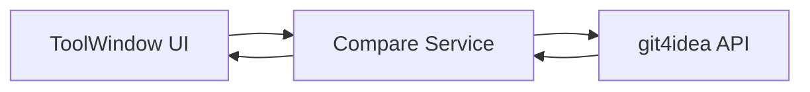
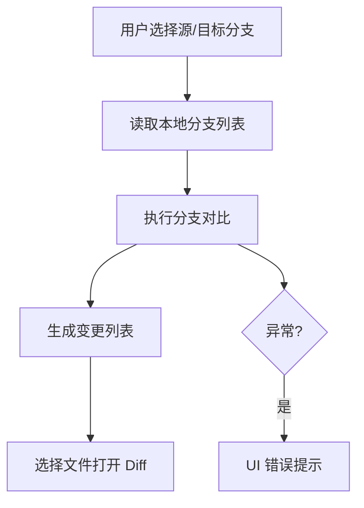

## Product Overview

本地 PR 查看 MVP 插件：在 IntelliJ IDEA 2024.1 中通过工具窗口选择源/目标分支，基于本地 Git 分支对比展示变更与 Diff。

## Core Features

- 工具窗口入口，提供源/目标分支下拉选择与刷新
- 基于 git4idea 的分支对比与变更列表展示
- 选中文件后显示 Diff 视图与变更详情
- 轻量错误提示（无分支/无变更/比较失败）

## Tech Stack

- 插件开发：IntelliJ Platform SDK + Kotlin
- 构建工具：Gradle (IntelliJ Plugin)
- Git 对比与 Diff：git4idea
- UI：IntelliJ Platform UI (ToolWindow + Swing)

## Tech Architecture

### System Architecture

- 采用插件模块分层：UI 层（工具窗口）→ 领域服务层（分支与对比）→ git4idea 适配层  



### Module Division

- **ToolWindow UI 模块**：分支选择、变更列表、Diff 入口
- **Branch & Compare Service 模块**：分支读取、比较结果聚合、错误处理
- **git4idea Adapter 模块**：封装 git4idea 调用与结果转换

### Data Flow



## Implementation Details

### Core Directory Structure

```
project-root/
├── src/main/kotlin/
│   ├── toolwindow/
│   │   ├── PrManagerToolWindow.kt
│   │   └── PrManagerPanel.kt
│   ├── service/
│   │   └── BranchCompareService.kt
│   ├── git/
│   │   └── Git4IdeaAdapter.kt
│   └── model/
│       └── ChangeItem.kt
└── src/main/resources/
    └── META-INF/plugin.xml
```

### Key Code Structures

**ChangeItem 数据结构**：承载文件路径、变更类型与可选的差异信息。

```
data class ChangeItem(
  val filePath: String,
  val changeType: String
)
```

**BranchCompareService 接口**：对外提供分支读取与比较结果。

```
interface BranchCompareService {
  fun listBranches(): List<String>
  fun compare(source: String, target: String): List<ChangeItem>
}
```

### Technical Implementation Plan

1. **Problem**：在工具窗口展示本地分支并支持选择  
**Approach**：读取本地仓库分支列表，填充下拉框
**Steps**：获取仓库→读取分支→刷新 UI
**Testing**：无仓库/空分支场景

2. **Problem**：分支对比与变更列表  
**Approach**：使用 git4idea 执行 compare，转换为 ChangeItem
**Steps**：执行比较→解析结果→列表展示
**Testing**：无差异/大变更量

3. **Problem**：Diff 展示  
**Approach**：基于 git4idea 提供的 Diff 展示入口
**Steps**：选中文件→构建 Diff 请求→打开 Diff 视图
**Testing**：新增/删除/重命名文件

### Integration Points

- UI 与服务层通过方法调用传递数据对象
- git4idea API 返回结果统一转换为 ChangeItem